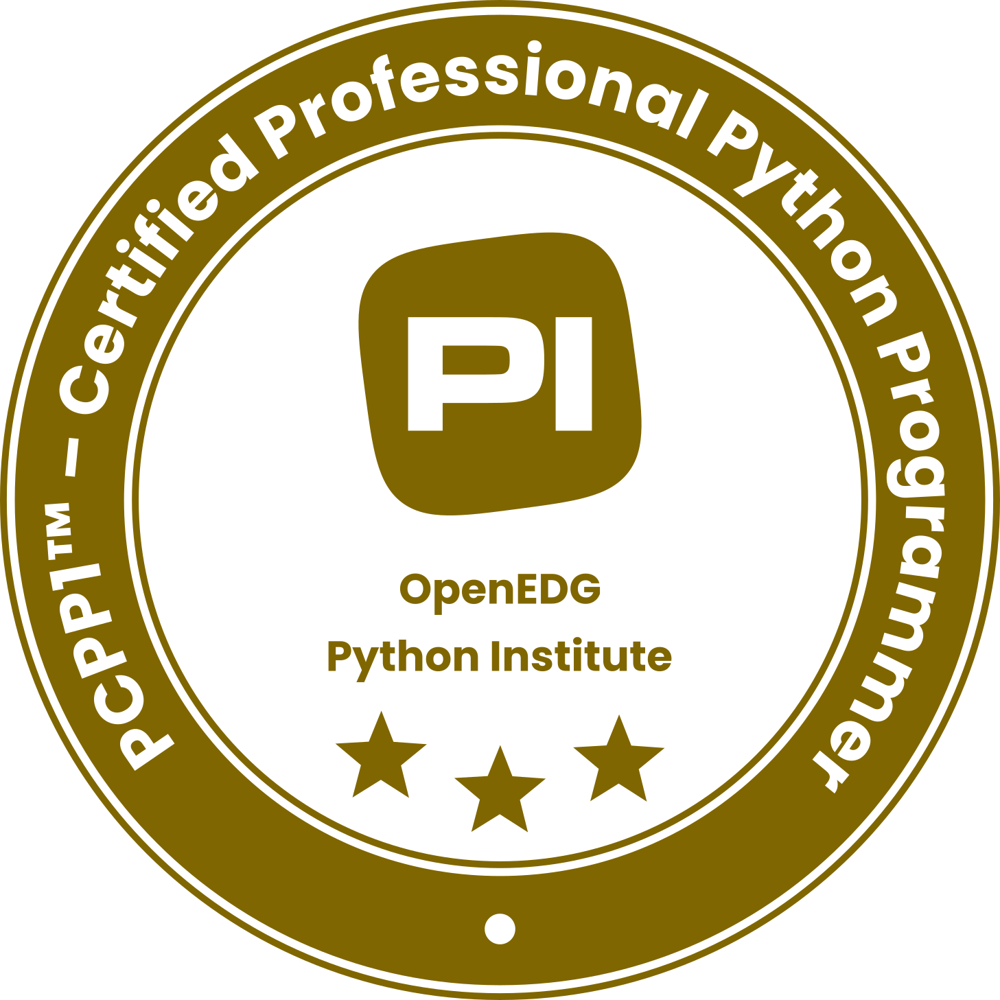

# python-pcpp1
Everything you need to know to pass the PCPP1 exam by [pythoninstitute.org](https://pythoninstitute.org/pcpp1).

## Documentation
The [documentation](doc/doc.pdf) includes all topics covered in the exam.

## Useful Links
- [Exam Syllabus](https://pythoninstitute.org/assets/628def5091da2303121759.pdf)
- [Courses Aligned / OpenEDG Education Platform](https://pythoninstitute.org/pcpp1)
- [YouTube: Tkinter Course - Create Graphic User Interfaces in Python Tutorial](https://youtu.be/YXPyB4XeYLA?si=pb_nie0gseMJEhVG)
- [Youtube: Python lists, sets, and tuples explained](https://www.youtube.com/watch?v=gOMW_n2-2Mw)
- [Udemy: 6 Practice Exams by Paweł Krakowiak](https://www.udemy.com/course/become-a-certified-professional-in-python-programming-1-with-pcpp1/)
- [Examtopics: Python Institute PCPP-32-101 Exam](https://www.examtopics.com/exams/python-institute/pcpp-32-101/)

